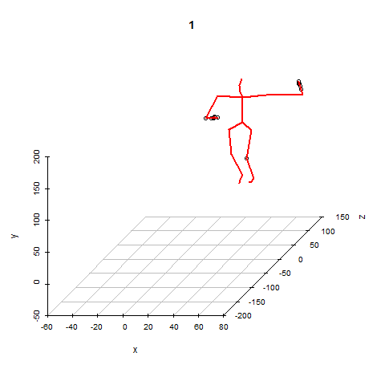

<!-- README.md is generated from README.Rmd. Please edit that file -->

This package holds functions to easily parse motion capture ("mocap") files. Currently only ASF/AMC files are supported, and only those found in the [Carnegie Mellon University Graphics Lab Motion Capture Database](http://mocap.cs.cmu.edu/) have been tested.

```{r, echo = FALSE}
knitr::opts_chunk$set(
  collapse = TRUE,
  comment = "#>",
  fig.path = "README-"
)
```

Install:
```{r, eval = FALSE}
devtools::install_github("gsimchoni/mocap")
```

Load:
```{r}
library(mocap)
```

Parse a ASF file:
```{r}
asfFilePath <- system.file("extdata", "lambada.asf", package = "mocap")
asf <- readASF(asfFilePath)
```

Parse a AMC file:
```{r}
amcFilePath <- system.file("extdata", "lambada.amc", package = "mocap")
amc <- readAMC(amcFilePath, asf)
```

Get Motion Data:
```{r}
xyz <- getMotionData(asf, amc)
```

Make a GIF out of it (if you have the `scatterplot3d` and `animation` packages installed):
```{r, eval = FALSE}
makeMotionMovie(asf, amc, xyz, skipNFrames = 4)
```



More information and examples [here](http://giorasimchoni.com).