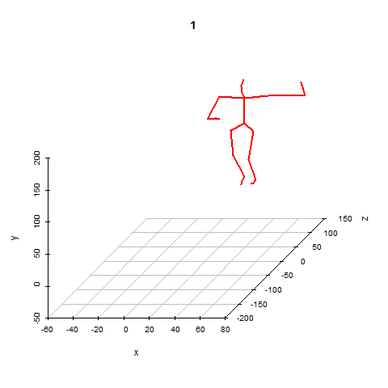
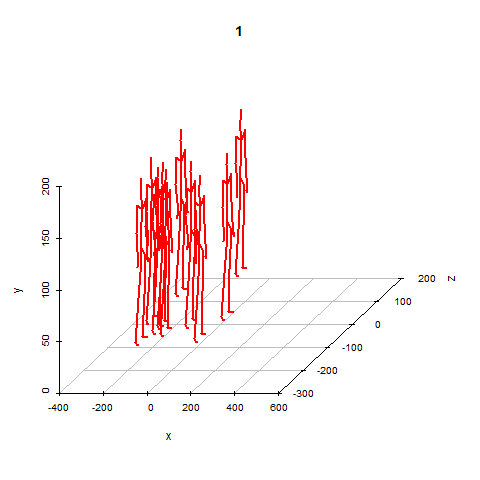
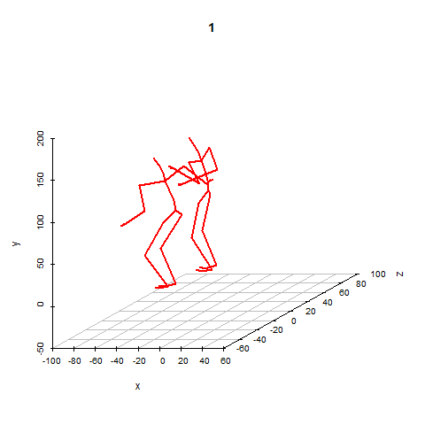

<!-- README.md is generated from README.Rmd. Please edit that file -->
This package holds functions to easily parse motion capture ("mocap") files. Currently only ASF/AMC files are supported, and only those found in the [Carnegie Mellon University Graphics Lab Motion Capture Database](http://mocap.cs.cmu.edu/) have been tested.

Install:

``` r
devtools::install_github("gsimchoni/mocap")
```

Load:

``` r
library(mocap)
```

Parse a ASF file:

``` r
asfFilePath <- system.file("extdata", "lambada.asf", package = "mocap")
asf <- readASF(asfFilePath)
```

Parse a AMC file:

``` r
amcFilePath <- system.file("extdata", "lambada.amc", package = "mocap")
amc <- readAMC(amcFilePath, asf)
```

Get Motion Data:

``` r
xyz <- getMotionData(asf, amc)
```

Make a GIF out of it (if you have the `scatterplot3d` and `animation` packages installed):

``` r
makeMotionMovie(asf, amc, xyz, skipNFrames = 4)
```



Animate a few skeletons from a single one:

``` r
asfFilePath <- system.file("extdata", "zombie.asf", package = "mocap")
asf <- readASF(asfFilePath)
amcFilePath <- system.file("extdata", "zombie.amc", package = "mocap")
amc <- readAMC(amcFilePath, asf)
xyz <- getMotionData(asf, amc)
makeMotionMovie(asf, amc, xyz, skipNFrames = 3, nSkeletons = 10, sdExtraSkeleton = 100)
```



Animate two *different* skeletons simultaneously:

``` r
asfFile <- system.file("extdata", "charleston.asf", package = "mocap")
asf <- readASF(asfFile)
amcFile1 <- system.file("extdata", "charleston1.amc", package = "mocap")
amc1 <- readAMC(amcFile1, asf)
amcFile2 <- system.file("extdata", "charleston2.amc", package = "mocap")
amc2 <- readAMC(amcFile2, asf)
xyz1 <- getMotionData(asf, amc1)
xyz2 <- getMotionData(asf, amc2)
makeMotionMovie(asf, amc1, xyz1, skipNFrames = 2,
                twoSkeletons = TRUE, amc2 = amc2, xyz2 = xyz2, viewAngle = 20)
#> Warning in makeMotionMovie(asf, amc1, xyz1, skipNFrames = 2, twoSkeletons = TRUE, : twoSkeletons mode, no. of frames in amc and amc2 objects is not
#>               equal, taking the minimum.
#> Executing: 
#> "convert -loop 0 -delay 1.66666666666667 motion1.png motion2.png
#>     motion3.png motion4.png motion5.png motion6.png motion7.png
#>     motion8.png motion9.png motion10.png motion11.png
#>     motion12.png motion13.png motion14.png motion15.png
#>     motion16.png motion17.png motion18.png motion19.png
#>     motion20.png motion21.png motion22.png motion23.png
#>     motion24.png motion25.png motion26.png motion27.png
#>     motion28.png motion29.png motion30.png motion31.png
#>     motion32.png motion33.png motion34.png motion35.png
#>     motion36.png motion37.png motion38.png motion39.png
#>     motion40.png motion41.png motion42.png motion43.png
#>     motion44.png motion45.png motion46.png motion47.png
#>     motion48.png motion49.png motion50.png motion51.png
#>     motion52.png motion53.png motion54.png motion55.png
#>     motion56.png motion57.png motion58.png motion59.png
#>     motion60.png motion61.png motion62.png motion63.png
#>     motion64.png motion65.png motion66.png motion67.png
#>     motion68.png motion69.png motion70.png motion71.png
#>     motion72.png motion73.png motion74.png motion75.png
#>     motion76.png motion77.png motion78.png motion79.png
#>     motion80.png motion81.png motion82.png motion83.png
#>     motion84.png motion85.png motion86.png motion87.png
#>     motion88.png motion89.png motion90.png motion91.png
#>     motion92.png motion93.png motion94.png motion95.png
#>     motion96.png motion97.png motion98.png motion99.png
#>     motion100.png motion101.png motion102.png motion103.png
#>     motion104.png motion105.png motion106.png motion107.png
#>     motion108.png motion109.png motion110.png motion111.png
#>     motion112.png motion113.png motion114.png motion115.png
#>     motion116.png motion117.png motion118.png motion119.png
#>     motion120.png motion121.png motion122.png motion123.png
#>     motion124.png motion125.png motion126.png motion127.png
#>     motion128.png motion129.png motion130.png motion131.png
#>     motion132.png motion133.png motion134.png motion135.png
#>     motion136.png motion137.png motion138.png motion139.png
#>     motion140.png motion141.png motion142.png motion143.png
#>     motion144.png motion145.png motion146.png motion147.png
#>     motion148.png motion149.png motion150.png motion151.png
#>     motion152.png motion153.png motion154.png motion155.png
#>     motion156.png motion157.png motion158.png motion159.png
#>     motion160.png motion161.png motion162.png motion163.png
#>     motion164.png motion165.png motion166.png motion167.png
#>     motion168.png motion169.png motion170.png motion171.png
#>     motion172.png motion173.png motion174.png motion175.png
#>     motion176.png motion177.png motion178.png motion179.png
#>     motion180.png motion181.png motion182.png motion183.png
#>     motion184.png motion185.png motion186.png motion187.png
#>     motion188.png motion189.png motion190.png motion191.png
#>     motion192.png motion193.png motion194.png motion195.png
#>     motion196.png motion197.png motion198.png motion199.png
#>     motion200.png motion201.png motion202.png motion203.png
#>     motion204.png motion205.png motion206.png motion207.png
#>     motion208.png motion209.png motion210.png motion211.png
#>     motion212.png motion213.png motion214.png motion215.png
#>     motion216.png motion217.png motion218.png motion219.png
#>     motion220.png motion221.png motion222.png motion223.png
#>     motion224.png motion225.png motion226.png motion227.png
#>     motion228.png motion229.png motion230.png motion231.png
#>     motion232.png motion233.png motion234.png motion235.png
#>     motion236.png motion237.png motion238.png motion239.png
#>     motion240.png motion241.png motion242.png motion243.png
#>     motion244.png motion245.png motion246.png motion247.png
#>     motion248.png motion249.png motion250.png motion251.png
#>     motion252.png motion253.png "motion.gif""
#> Output at: motion.gif
#> [1] TRUE
```



More information and examples [here](http://giorasimchoni.com).
